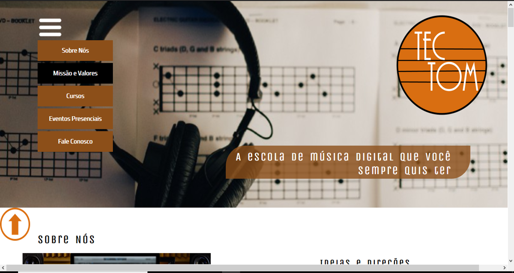
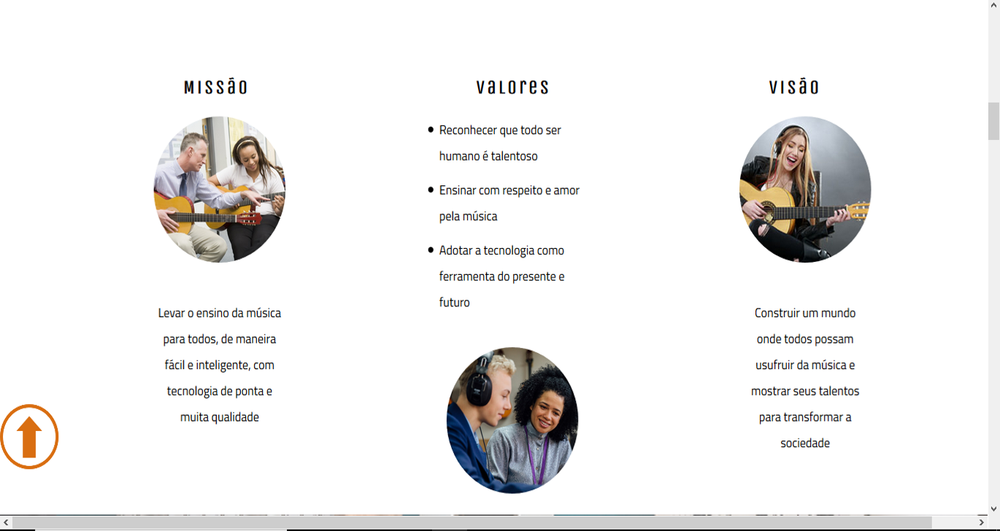
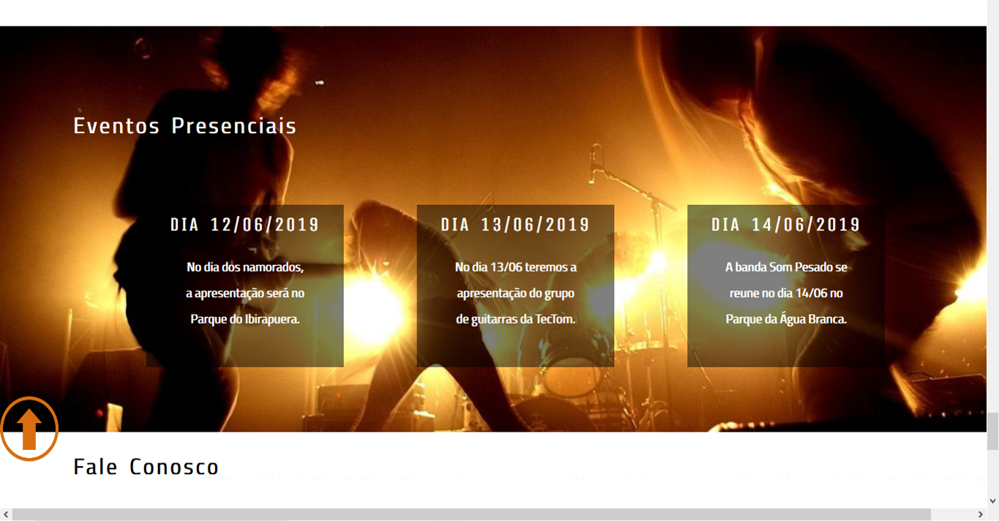
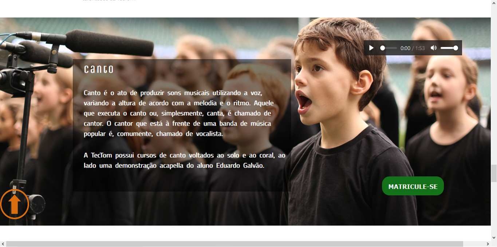
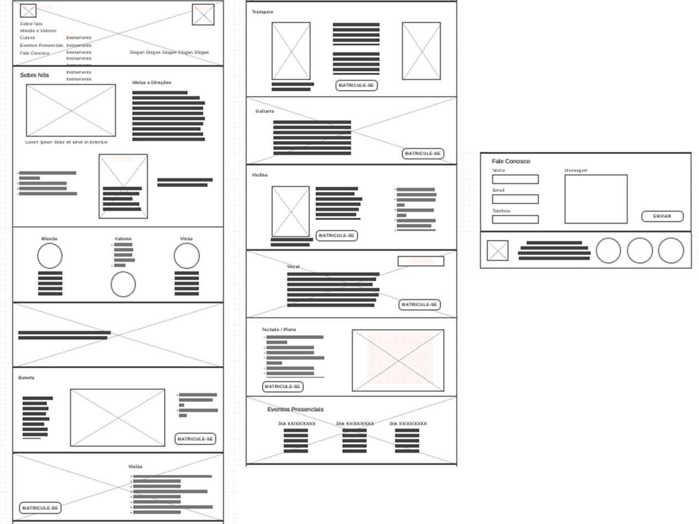

# TecTom-Project
A HTML5/CSS3 Project

This project was the final avaliation project from the discipline of "Web Interfaces", learned in SENAI technical school. 
The challenge was to create a website SAP applying everything learned about HTML5 and CSS3, without CSS frameworks, with a free theme.

The ideia was create a website about a fictional digital music school, called TecTom, that offers a lot of courses, including a diversity of instruments and vocal training.

Simulating a real music school, a lot of information was created to show some situtations and describe the courses and events.

Inspired by the music universe, the website was built, including midia resources as audio and video, and bringing a great visual experience.

The single page website was built following a preview wireframe made by the autor.

This project had the objective of learning and putting into practice the concepts of web interfaces. The author has no possession of the images and were only used for didactic purposes. TecTom is a fictional corporation, also created for educational purposes.

Version: 1.0

Creation: 19/06/2019

*Everything made with a lot of curiosity and programming passion* 
